## Table of Contents
1. [Setting up the example project](#setting-up-the-example-project)
2. [Create the Elastic Beanstalk Application](#create-the-elastic-beanstalk-application)
3. [Create the Elastic Beanstalk Environment](#create-the-elastic-beanstalk-environment)
4. [Create the Environment Variables](#create-the-environment-variables)
5. [Deploying Changes to Elastic Beanstalk](#deploying-changes-to-elastic-beanstalk)
6. [Setting up a domain name](#setting-up-a-domain-name)
7. [Debugging Common Problems](#debugging-common-problems)

## Setting up the example project

### Set Up
Clone the [repository](https://github.com/j0nah/deploy-example)
```sh
git clone git@github.com:j0nah/deploy-example.git
```

Rename the example environment file so it's picked up by Next.js
```sh
cd deploy-example/
cp example.env .env.local
```

Start the application
```sh
npm install
npm run dev
```

You should see something like
```sh
% npm run dev

> deploy-example@0.1.0 dev
> next dev
```

Finally, when you navigate to [http://localhost:3000/](http://localhost:3000/), you should see:

```sh
Hello, from local
```

### File Walkthrough
The three files we're going to look at for this blog post are:
```
- .env
- .env.local
- app/page.tsx
- app/actions.tsx
- .ebignore
```
`.env` defines environment variables that we plan on checking into source control. Specifically our server side environment variables `GREETING` will be defined for all environments in `.env`. 

`example.env` defines the environment variable `NEXT_PUBLIC_GREETING_ENVIRONMENT`

`page.tsx` is our index page. It loads the `GREETING` and `NEXT_PUBLIC_GREETING_ENVIRONMENT` variables and displays a message on the index page of our application

`actions.tsx` is a server-side async function that fetches our server-only environment variable, `NEXT_PUBLIC_GREETING_ENVIRONMENT`, for use on the index page.

`.ebignore` defines files that won't be packages and uploaded to Elastic Beanstalk. Specifically, I don't want to include the `.env.local` file in the package we deploy on Elastic Beanstalk.

While bare-bones, these will be enough to demonstrate deploying the application and setting Elastic Beanstalk environment variables.

## Create the Elastic Beanstalk Application

### Install ebcli
First, you should install the [ebcli](https://github.com/aws/aws-elastic-beanstalk-cli-setup#22-installupgrade-the-eb-cli) tool.

### Build Production Artifact
Once that's installed, navigate to you the `deploy-example` directory and get a production build of your application ready for deploy.

```sh
cd deploy-example/
npm run build
```

We want to make sure that a production build was created. We can confirm that by locating the `.next` folder. 

```sh
ls -al | grep "\.next"
```

should give us something like

```sh
drwxr-xr-x   21 j0nah  staff     672 Aug  6 19:59 .next
```

### Initialize the Application
Start with the command `eb init`. Your mileage may vary, but I typically choose the default option except for the following exceptions:

When it asks to create a new application. For this post, I'll create an environment called `deploy-example`.

When it asks if I'm using Node.js, I'll choose "Y"
```sh
It appears you are using Node.js. Is this correct?
(Y/n): Y
```

When it asks if I'd like to use CodeCommit, I choose "n"
```sh
Do you wish to continue with CodeCommit? (Y/n): n
```

When it asks to set up SSH, I choose "Y". Note, this is optional and for this post you can also just use the browser-based ec2 SSH environment if you don't feel like setting this up right now.
```sh
Do you want to set up SSH for your instances?
(Y/n): Y
```

## Create the Elastic Beanstalk Environment
If you don't already have an environment set up, we can set up the EB environment using the `ebcli` tool. 

Note, creating this environment will automatically deploy your application, so keep that in mind.
```sh
eb create
```

The following are the options that I chose:
```sh
Enter Environment Name
(default is deploy-example-dev): deploy-example-prod
Enter DNS CNAME prefix
(default is deploy-example-prod): deploy-example-prod

Select a load balancer type
1) classic
2) application
3) network
(default is 2): 2

Would you like to enable Spot Fleet requests for this environment? (y/N): n
```

Execution of that command will give us a lot of details that will help you understand the status of our deployment. One I want to draw your attention to is the line that gives us the `CNAME`. Something like
```sh
CNAME: deploy-example-prod.us-west-2.elasticbeanstalk.com
```

When your application is deployed, you can head to [deploy-example-prod.us-west-2.elasticbeanstalk.com](http://deploy-example-prod.us-west-2.elasticbeanstalk.com)
to see it in action!

Navigating to your Elastic Beanstalk environment should show all green if everything worked properly:
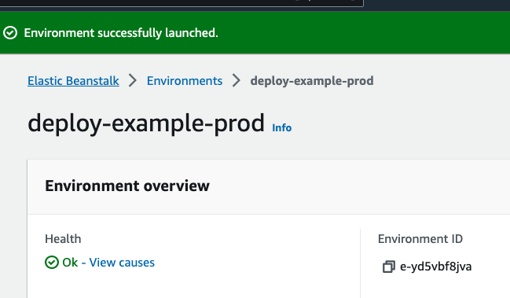


### Bump instance type
While it is true that this can work with a `micro`, from experience it seems that this isn't enough memory to consistently run a Next.js application. Even one this tiny. We're going to bump this to a `t3.small` and I promise it will save you a lot of heartache. We can do this easy from the AWS console. 

First, head over to your Elastic Beanstalk environment in the AWS console and click the name of the environment you would like to work with
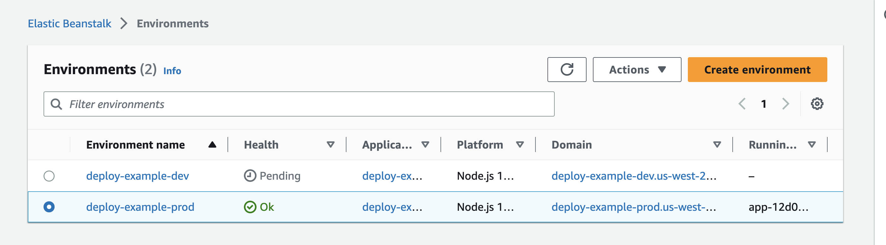

In the left hand panel of the next page, select "Configuration""
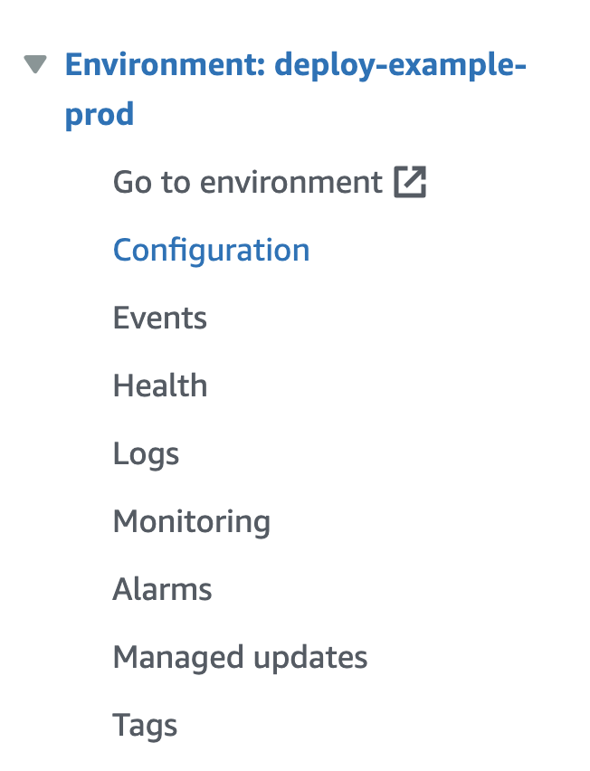

Scroll to the "Instance, traffic, and scaling" section and select Edit
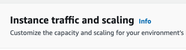

Click the "x" next to `micro` so that only `small` remains
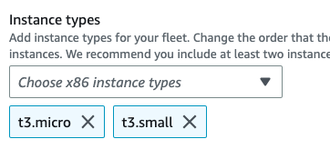

Scroll down to the bottom of the page and click "Apply". Your application should restart now (it will take some time) on a small rather than micro instance.

## Create the Environment Variables
The following is an ascending priority list of how the environment variables are read by Next.js
1. process.env
2. .env.$(NODE_ENV).local
3. .env.local (Not checked when NODE_ENV is test.)
4. .env.$(NODE_ENV)
5. .env

[source: next.js](https://nextjs.org/docs/pages/building-your-application/configuring/environment-variables#environment-variable-load-order)

by precedence here, I mean that a value in `.env` will overwrite the same variable defined in `.env.local` or `process.env`. 

### Defining environment variables in Elastic Beanstalk
To save you from some googling, note that the variables pre-fixed with `NEXT_PUBLIC_` are baked into your production build. This means that they won't change relative to the environment the application is run in. Instead, their values will be frozen based on the environment they are **built** in. This means, unless we're building on the Elastic Beanstalk environment (we aren't in this post) the only variables we can define are server-side variables, or those without the `NEXT_PUBLIC_` prefix.

Defining environment variables is fairly simple through the console. 

First, head over to your Elastic Beanstalk environment in the AWS console and click the name of the environment you would like to work with


In the left hand panel of the next page, select "Configuration""


Scroll to the "Updates, monitoring, and logging" section and select Edit
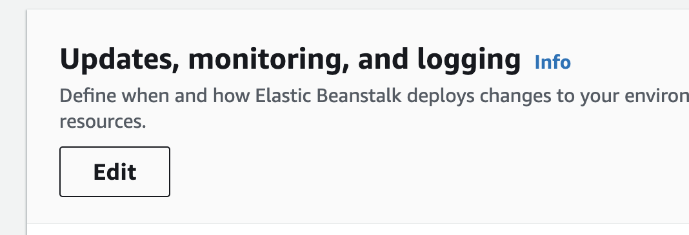

Click "Add environment property"
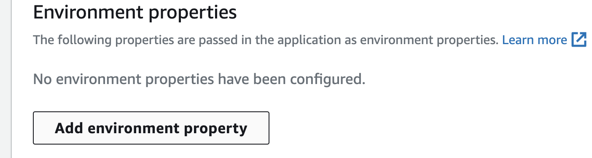

For testing purposes let's add a "GREETING" as "Haldo"
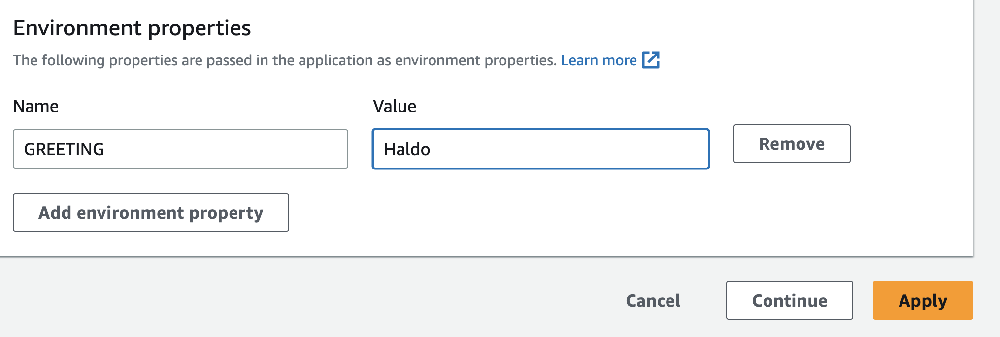

Then just click "Apply" and wait for the app to reboot.

### It didn't work!
Hold on, that's weird. When we refreshed the page and we still see "Hello, from local" but based on the code in `page.tsx` and the environment variable, we should see `Haldo, from local`. This is because of the [priority rules](#create-environment-variables)the Next.js environment uses for environment variables. Note, we did set the environment variable correctly but it's considered `process.env` which is lower priority than the `.env` file. To solve this, let's rename the `.env` to `example.env` and re-deploy.

```sh
cd deploy-example/
mv .env old.env
eb deploy
```

when the deploy is finished, you should be able to navigate back to your site and see: `Haldo, from local`.

## Deploying Changes to Elastic Beanstalk
You probably caught it from the previous section, but if you want to make changes to your application, it's very simple. Let's just update the background color in our application.

Head over to `page.tsx` and append `bg-red-50` to the end of the `className`. It should now read something like
```
flex min-h-screen flex-col items-center justify-between p-24 bg-red-50
```
Next, we'll run a production build, package, and deploy our changes.

```sh
npm run build
eb deploy
```


## Setting up a domain name
I bought the cheapest domain name I could find on Namecheap. We're going to point into to AWS and then point that at our deployed Elastic Beanstalk application.

### Point Nameservers at AWS
After purchasing the domain name, head over to Route 52 on AWS and click "Created hosted zone"
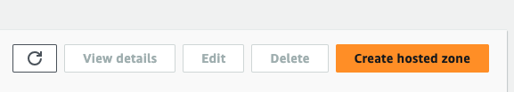

The only setting I'm going to add is the name
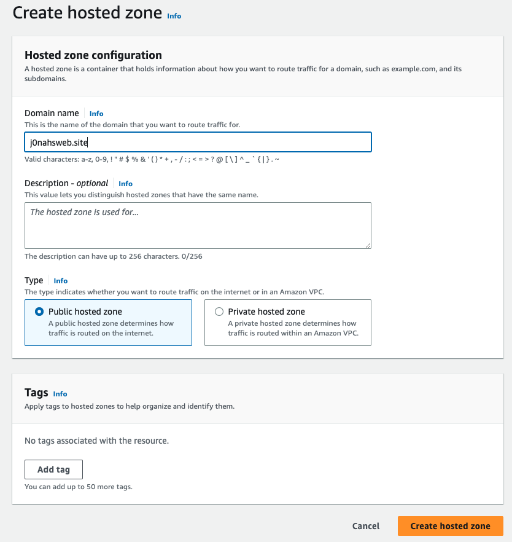

It will bring us to the Route 52 page which has a record with the nameservers we're going to add to Namecheap
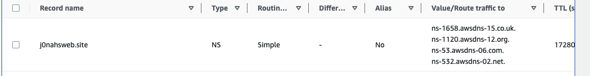

We'll set these values on Namecheap
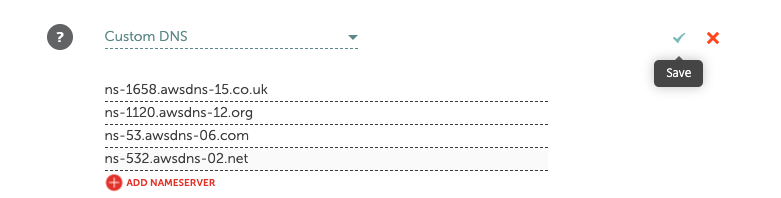

### Point Domain at Elastic Beanstalk Application
Back to Route 53, we're going to create an A record to point to the Elastic Beanstalk application. Click "Create Record" and create a new A record. Note how we have the "Alias" option selected and we're routing to a specific Elastic Beanstalk environment:
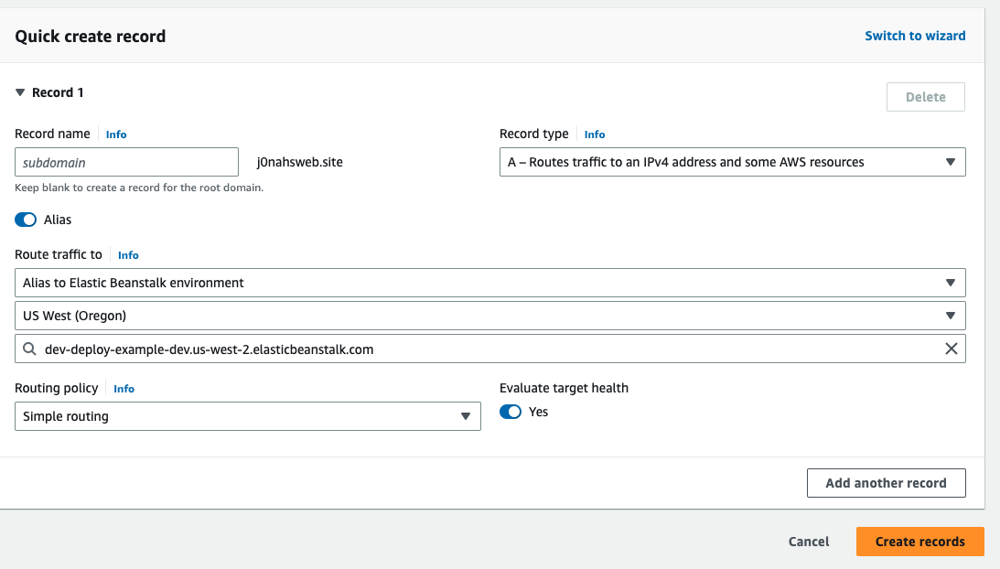

It likely won't work immediately. We need to wait for the DNS to propagate. 

## Debugging Common Problems
### My environment variable isn't working 
If you can't seem to get your environment variable to work, check on a couple things:

First, make sure that it's defined properly based on the precedece described [above](#create-the-environment-variables). Remember, if you've got any un-ignored `.env` file in the package directory, it will replace any values you defined in Elastic Beanstalk.

Second, if you expect it to be available in the browser or client code you *MUST* define the variable prefixed with `NEXT_PUBLIC_`.

### Applying environment variables failed and put my app in an error state
First, please consider [upgrading to a small](#bump-instance-type) if you haven't. This can often solve a lot of problems.

Another way I've found to deal with it is just by "rebuilding" the environment from the environment page on the AWS console.
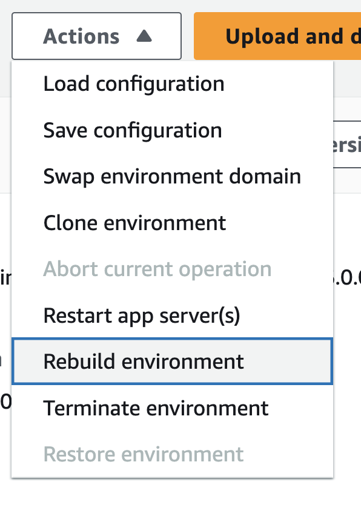

### My app just remains in the severe state all time time
First, please consider [upgrading to a small](#bump-instance-type) if you haven't. This can often solve a lot of problems.

Second, check your logs. If you see something like:
```sh
Could not find a valid build in the '.next' directory! Try building your app with 'next build' before starting the server.
```

then you may have forgotten to `npm run build` before you ran `eb deploy`. 

### My question isn't answered
Can't find your error here? Leave it as a comment or email me at `contact@j0nah.com` and we'll solve it together!